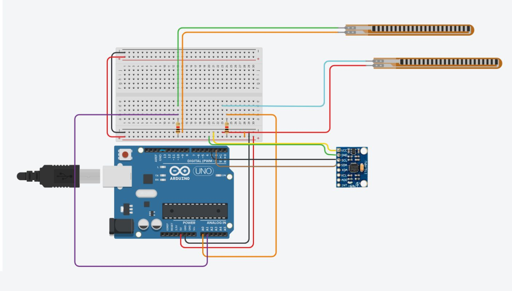

# Smart Glove 🧤
## Acessibilidade que Transforma, Diversão que Reabilita
### Componentes necessários para a execução do protótipo:
```
⚙️
├── Arduino Leonardo
├── Protoboard
├── 2 Sensores de Pressão RP-L-110
├── Giroscópio MPU-6050
└── Resistores 10K Ω
```
### Como executar o projeto:
- Realizar a montagem seguindo a imagem do circuito;
- Baixar e executar o código no software do Arduino;
- Conectar a placa a um computador e verificar o código;
- Fazer upload e se divertir!

